

	

## 📌 SKILL 📌

	<h3>📚 Language 📚</h3>
	
	
	
	 
	
	
	 
	
	

 

	<h3>📚 FrameWork 📚</h3>
	
	
	

 

	<h3>💾 DataBase 💾</h3>
	
	
	

 

	<h3>📡 Server 📡</h3>
	
	

 

	<h3>⚙ Tool ⚙</h3>
	
	
	
	 
	
	
	
	
	 
	
	
	 
	
	
	

  

	  
	  

 	<!-- 백준 티어 (백준 solved.ac) -->
	  

	<!-- solved.ac 사용 빈도 그래프 -->
	

   

## 📋 PROJECT 📋 
### 1. 숙박예약 사이트 개발 프로젝트
You can access this link <https://ga-000.github.io/Yanolja_Reservation_System/>

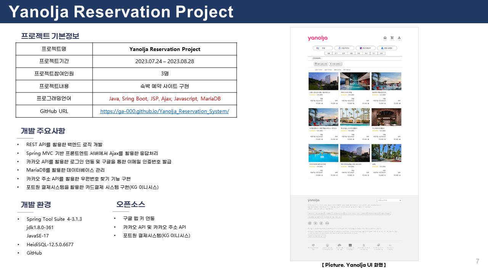

### 2. 음악 스트리밍 사이트 개발 프로젝트
You can access this link <https://ga-000.github.io/WaterMelon_MusicPlayer/>

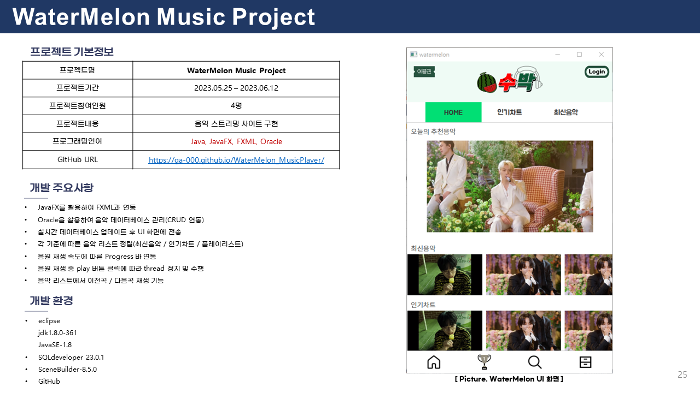

### 3. 인공지능 미로찾기 게임 개발 프로젝트
You can access this link <https://ga-000.github.io/Wumpus_World/>

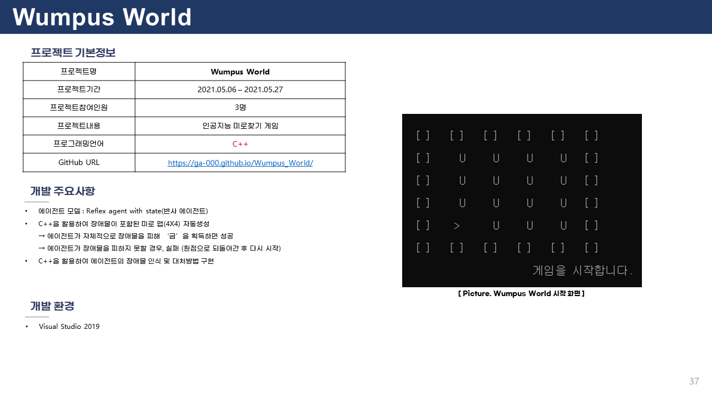

### 4. 프로그래머 계산기 구현 프로젝트
You can access this link <https://ga-000.github.io/Programmable_Calculator/>

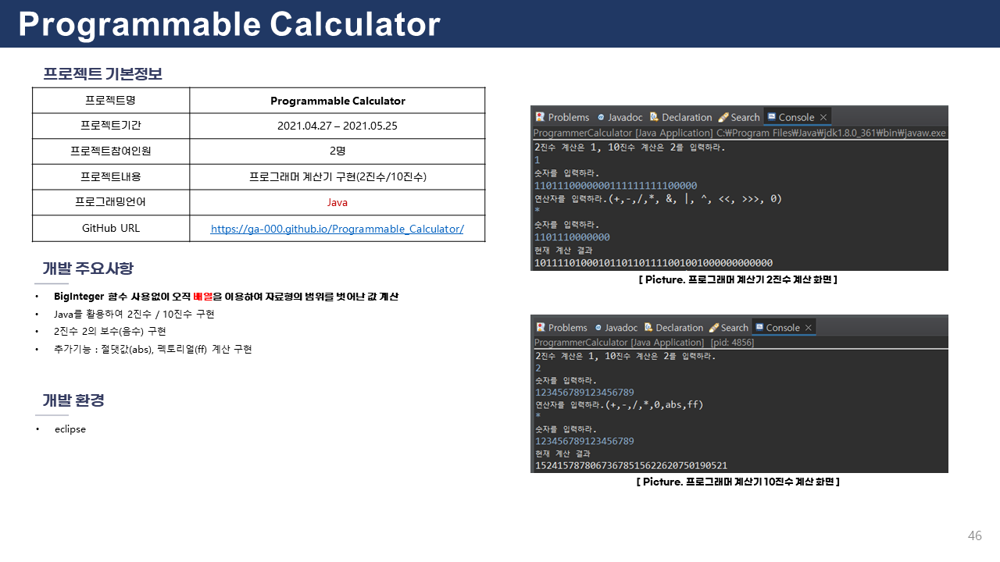

## 🖼 Web Page 🖼
### 1. 상담신청 페이지
You can access this link <https://ga-000.github.io/Consultation-Request_page/>

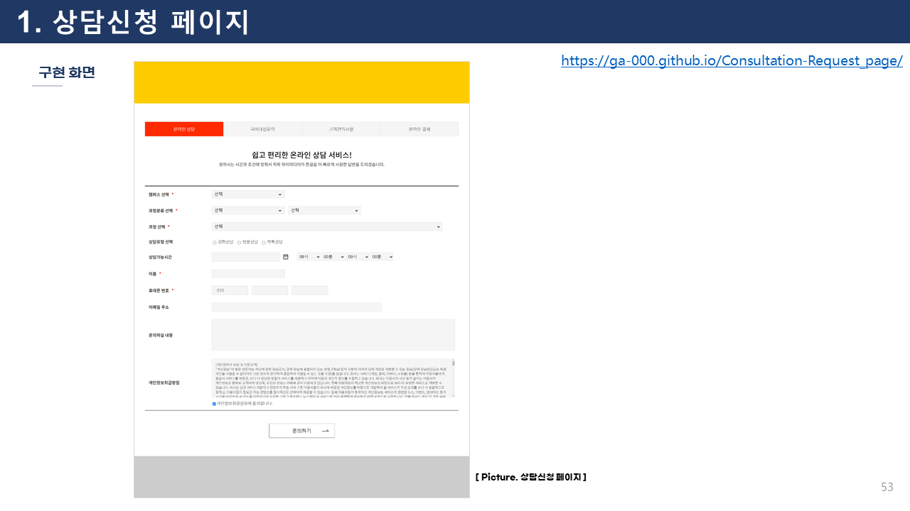
   
### 2. 프렌차이즈 치킨 홍보 페이지(모바일버전)
You can access this link <https://ga-000.github.io/Franchise-Chicken_mobilePage/>

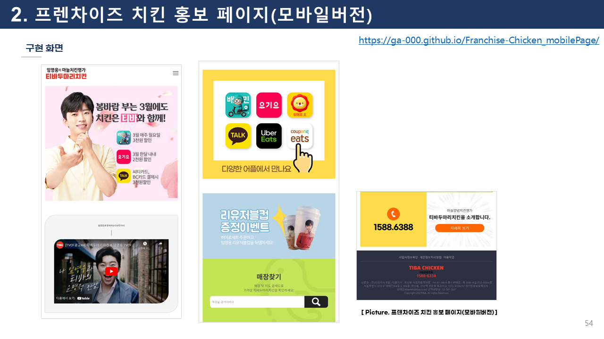

### 3. ICT-COG 페이지
You can access this link <https://ga-000.github.io/ICT-COG_page/>

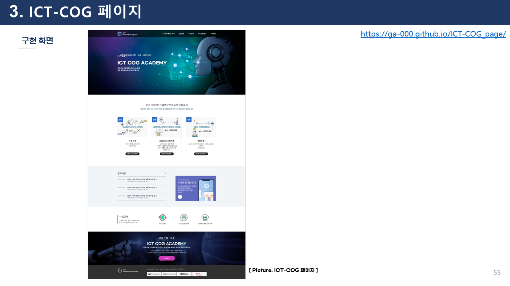

### 4. ICT-COG 페이지(모바일버전)
You can access this link <https://ga-000.github.io/ICT-COG_mobilePage/>

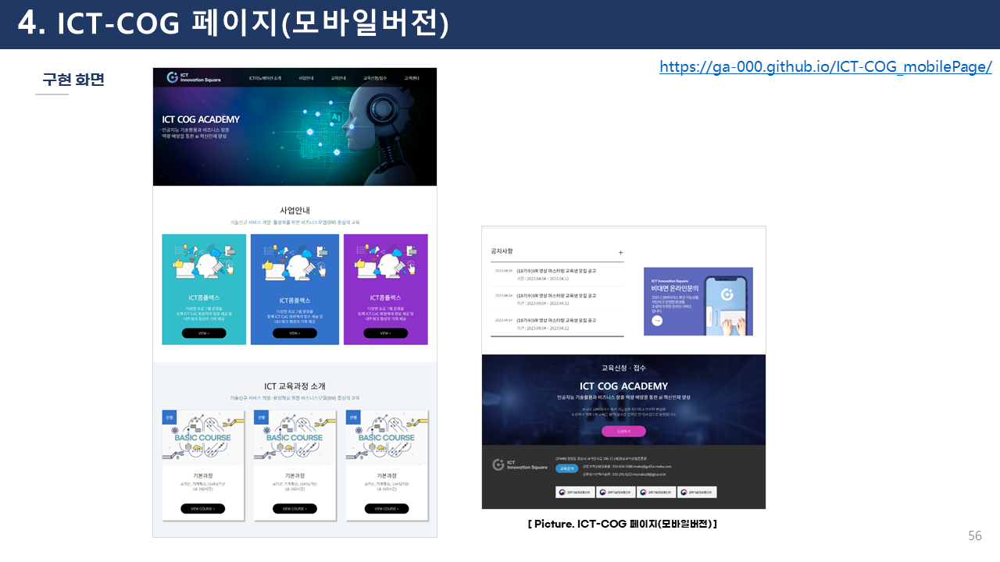

### 5. 강릉 홍보 페이지(모바일버전)
You can access this link <https://ga-000.github.io/Gangneung-PR_mobilePage/>

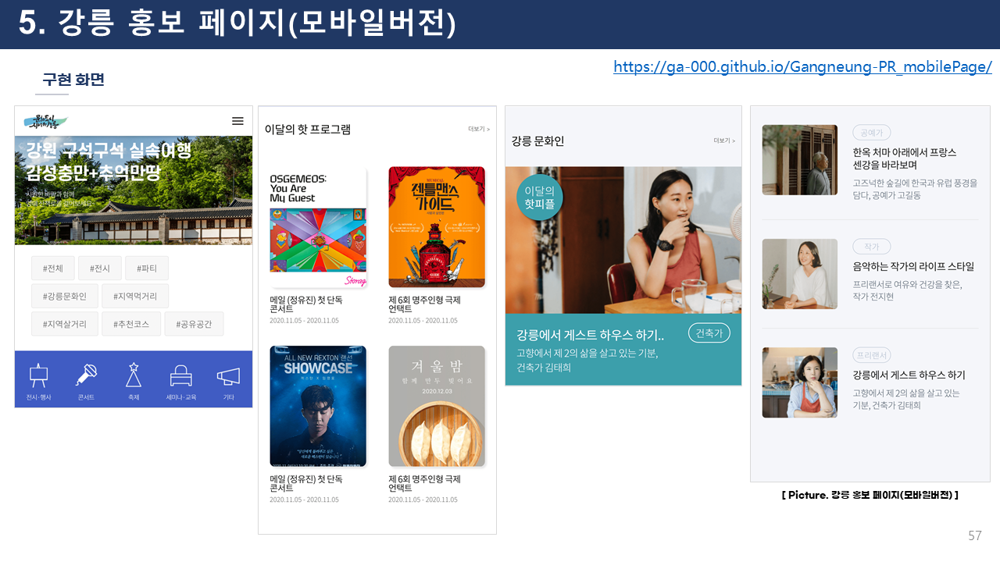

### 6. 원덕 홍보 페이지
You can access this link <https://ga-000.github.io/Wondeok-PR_page/>

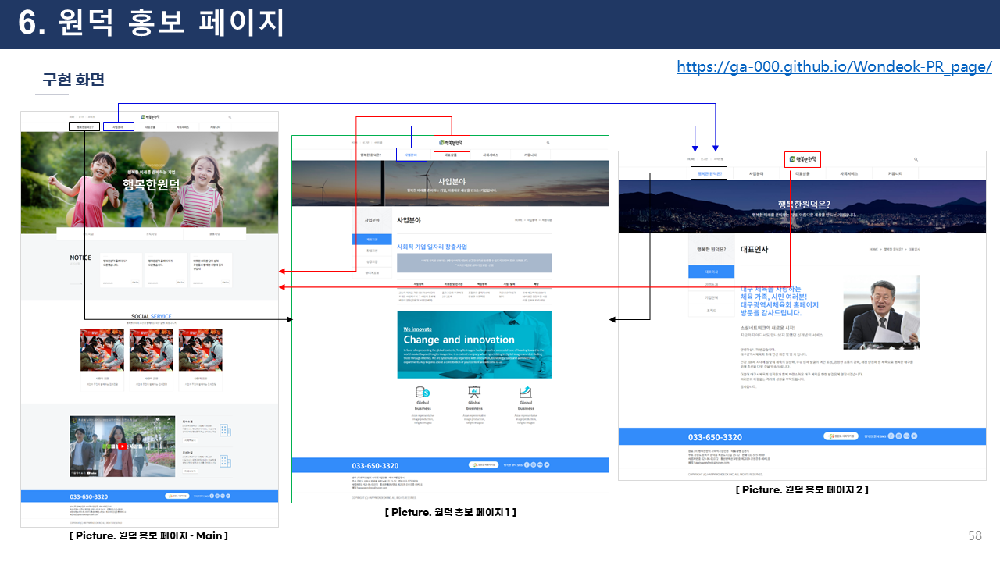

### 7. 푸른달 홍보 페이지
You can access this link <https://ga-000.github.io/BlueMoon-PR_page/>

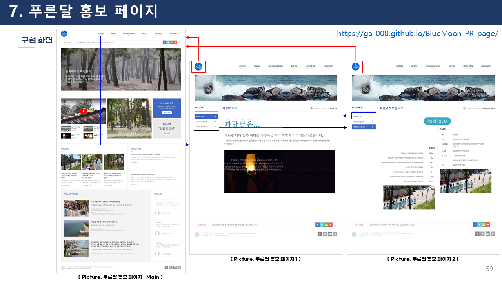

### 8. 렌터카 홍보 페이지
You can access this link <https://ga-000.github.io/TheGoodRentcar-PR_page/>

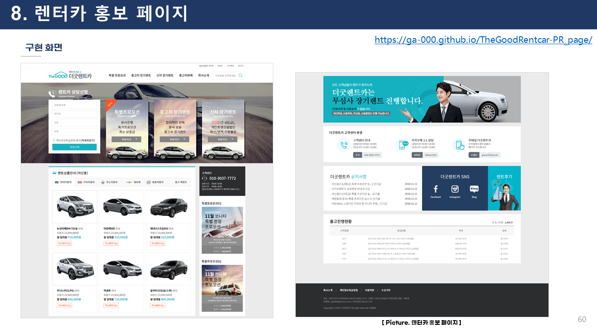

### 9. CJonstlye 로그인 페이지
You can access this link <https://ga-000.github.io/CJonstyle-Login_page/>

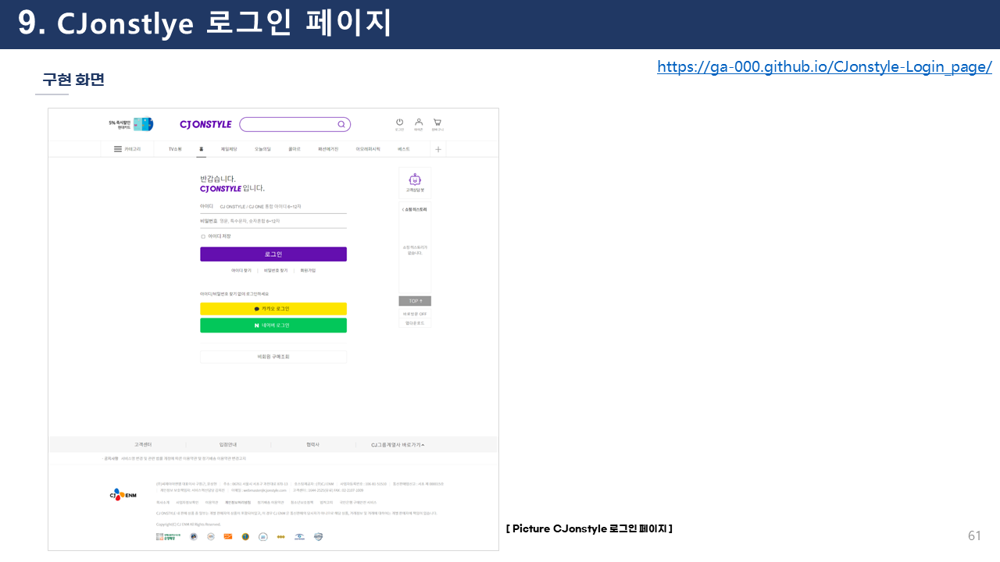

### 10. Smart Service 페이지
You can access this link <https://ga-000.github.io/Smart-Service_page/>

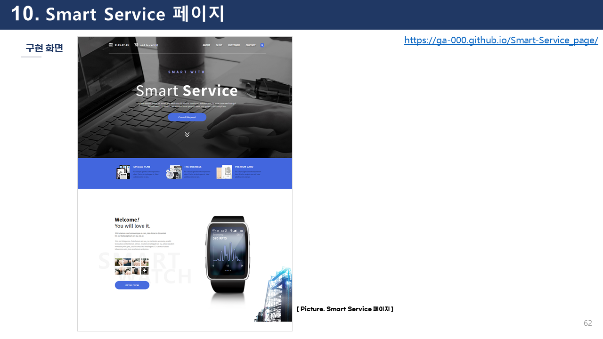

### 11. 여성병원 홍보 페이지
You can access this link <https://ga-000.github.io/Hospital_page/>

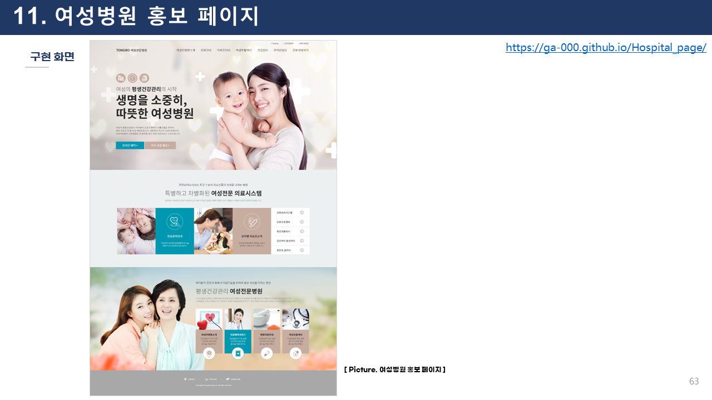

### 12. BBQ 홍보 페이지
You can access this link <https://ga-000.github.io/BBQ_page/>

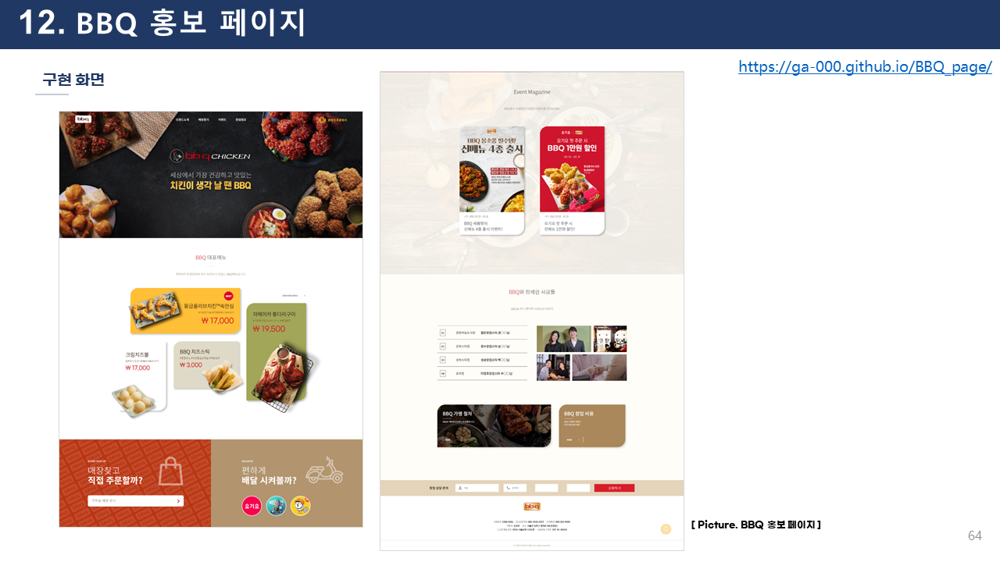

